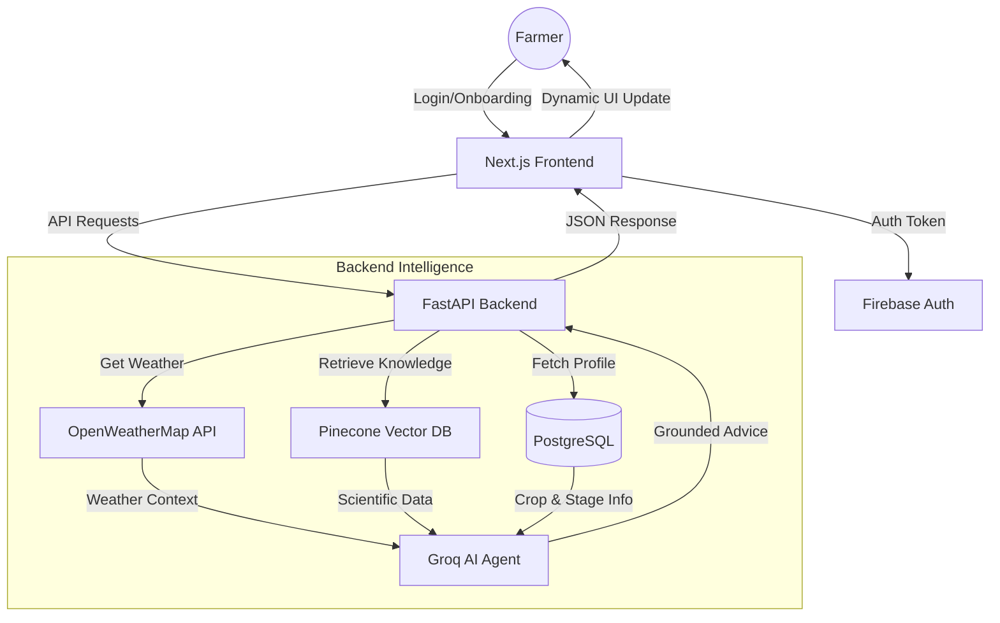

# CropMind AI - Precision Farming Advisor

CropMind AI is a comprehensive agricultural intelligence platform designed to help farmers track crop lifecycles, receive AI-driven advice grounded in scientific research (RAG), and monitor real-time weather conditions.

---

## 🏗 System Workflow Diagram

The following diagram illustrates the end-to-end data flow and architecture of the CropMind system:



---

## 🌟 Core Features

-   **Dynamic Crop Lifecycle Tracker**: Visualize the entire journey of your crop from planning to harvest with real-time progress bars and date tracking.
-   **AI-Powered Action Planner**: Get daily "What's Next" advice generated by Groq LLMs, grounded in real weather and expert agricultural research.
-   **Contextual Stage Chat**: Dedicated chat interface for every lifecycle stage, allowing farmers to ask specific questions about transplanting, flowering, or harvest.
-   **Real-Time Weather Integration**: Dynamic weather widget and AI context grounding based on the farmer's specific village location.
-   **Task Persistence**: Manual task checklist for each stage, allowing farmers to track their field activities.
-   **Multilingual Support**: Automatic translation of AI advice into the farmer's preferred language (English, Hindi, Marathi, etc.).

---

## 🛠 Tech Stack

### Frontend
-   **Framework**: Next.js 14 (App Router)
-   **Language**: TypeScript
-   **Styling**: Tailwind CSS + Shadcn UI
-   **State/Auth**: Firebase Authentication + React Context API
-   **Icons**: Lucide React

### Backend
-   **Framework**: FastAPI (Python 3.10+)
-   **Database**: PostgreSQL + SQLAlchemy ORM
-   **AI Inference**: Groq SDK (Llama models)
-   **Vector DB (RAG)**: Pinecone
-   **HTTP Client**: HTTPX (for async API calls)

### Infrastructure
-   **Containerization**: Docker & Docker Compose
-   **Orchestration**: System runs in a 3-container stack (Frontend, Backend, DB)

---

## 📁 Directory Structure

```text
Crop/
├── backend/
│   ├── app/
│   │   ├── api/            # API Route handlers (chat, lifecycle, dashboard)
│   │   ├── models/         # SQLAlchemy Database models
│   │   ├── schemas/        # Pydantic validation schemas
│   │   ├── services/       # Core logic (AI Agents, Weather, RAG)
│   │   └── config/         # YAML configurations for crops
│   ├── main.py             # Entry point
│   └── Dockerfile          # Backend container spec
├── frontend/
│   ├── app/                # Next.js pages and layouts
│   ├── components/         # Reusable UI components
│   ├── lib/                # API clients and Auth context
│   └── Dockerfile          # Frontend container spec
├── docker-compose.yml      # Orchestration for the whole stack
└── .env                    # Environment secrets
```

---

## 🚀 Setup & Installation

### Prerequisites
- Docker & Docker Compose installed
- API Keys for: Groq, Pinecone, Firebase, and OpenWeatherMap

### 1. Environment Configuration
Create a `.env` file in the root directory following `.env.example`:

```bash
# AI & Data
GROQ_API_KEY=your_key
PINECONE_API_KEY=your_key
WEATHER_API_KEY=your_key

# Database
DATABASE_URL=postgresql://user:password@db:5432/cropmind
```

### 2. Launch the Application
Run the following command to build and start all services:

```bash
docker-compose up --build
```

-   **Frontend**: [http://localhost:3000](http://localhost:3000)
-   **Backend API**: [http://localhost:8000](http://localhost:8000)
-   **API Docs**: [http://localhost:8000/docs](http://localhost:8000/docs)

---

## 📡 API Documentation

### Lifecycle Endpoints
-   `GET /lifecycle/status`: Returns the current progress, timeline, and AI summary.
-   `POST /lifecycle/toggle-task`: Marks a manual task as completed/pending.
-   `POST /lifecycle/advance-stage`: Manually pushes the farm to the next growth stage.

### Chat Endpoints
-   `POST /chat/query`: The main AI interface. Supports `stage_id` for contextual grounding.

### Dashboard Endpoints
-   `GET /dashboard/summary`: Quick stats for the home screen greeting.
-   `GET /dashboard/weather`: Returns the decoded weather data for the farm.

---

## 🧪 Development Workflow

1.  **Modify Backend**: Edit files in `backend/app/` and the container will reload if using dev volumes, or rebuild using `docker-compose up --build`.
2.  **Modify Frontend**: Edit components in `frontend/`. Next.js handles hot-reloading within the container.
3.  **Knowledge Base**: To update the RAG knowledge, ingest new PDFs/text into the Pinecone index named in your `.env`.

---

© 2026 CropMind AI Team - Empowering farmers with AI intelligence.
