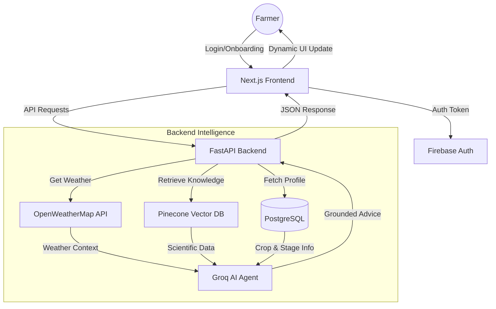

# CropMind AI - Precision Farming Advisor


[](https://opensource.org/licenses/MIT)
[](https://fastapi.tiangolo.com)
[](https://nextjs.org/)
[](https://www.postgresql.org/)
[](https://www.docker.com/)

> **Empowering farmers with AI-driven intelligence, real-time weather data, and scientific research.**

---

## 📖 Overview

**CropMind AI** is a comprehensive agricultural intelligence platform designed to bridge the gap between traditional farming and modern technology. By leveraging **RAG (Retrieval-Augmented Generation)**, the system provides farmers with accurate, scientifically grounded advice tailored to their specific crop lifecycle stage and local weather conditions.

### Key Capabilities
- **🌱 Lifecycle Tracking**: Visual journey from sowing to harvest.
- **🧠 AI Agronomist**: Context-aware advice using Groq & Llama models.
- **🌦️ Smart Weather**: Real-time hyper-local weather integration.
- **🗣️ Multilingual**: Native language support for accessibility.

---

## 🏗 System Architecture

The following diagram illustrates the end-to-end data flow of the CropMind system:



---

## 🌟 Core Features

| Feature | Description |
| :--- | :--- |
| **Dynamic Tracker** | Visualize crop progress with real-time progress bars and date tracking. |
| **Action Planner** | Daily "What's Next" advice grounded in expert agricultural research. |
| **Stage Chat** | Context-aware chat interface for specific lifecycle stages (e.g., flowering). |
| **Weather Widget** | Dynamic weather updates based on the farmer's village location. |
| **Task Lists** | Manual checklist for tracking field activities and interventions. |

---

## 🛠 Tech Stack

### Frontend
- **Framework**: `Next.js 14` (App Router)
- **Language**: `TypeScript`
- **UI Library**: `Tailwind CSS` + `Shadcn UI`
- **Auth**: `Firebase Authentication`

### Backend
- **Framework**: `FastAPI` (Python 3.10+)
- **Database**: `PostgreSQL` + `SQLAlchemy`
- **AI/LLM**: `Groq SDK` (Llama models)
- **Vector DB**: `Pinecone` (for RAG)

### Infrastructure
- **Containerization**: `Docker` & `Docker Compose`

---

## 📁 Directory Structure

```text
CropMind/
├── backend/                # FastAPI Application
│   ├── app/
│   │   ├── api/            # API Route handlers
│   │   ├── models/         # Database models
│   │   ├── services/       # AI & Logic layers
│   │   └── config/         # App configuration
│   └── Dockerfile
├── frontend/               # Next.js Application
│   ├── app/                # Pages & Routes
│   ├── components/         # UI Components
│   └── Dockerfile
├── docker-compose.yml      # Service Orchestration
└── .env                    # Environment Variables
```

---

## 🚀 Getting Started

### Prerequisites
- **Docker** & **Docker Compose** installed.
- API Keys for: **Groq**, **Pinecone**, **Firebase**, and **OpenWeatherMap**.

### Installation

1.  **Clone the repository**
    ```bash
    git clone https://github.com/ParthTCO/cropmind.git
    cd cropmind
    ```

2.  **Configure Environment**
    Create a `.env` file in the root directory (see `.env.example`):
    ```bash
    GROQ_API_KEY=your_key
    PINECONE_API_KEY=your_key
    WEATHER_API_KEY=your_key
    DATABASE_URL=postgresql://user:password@db:5432/cropmind
    ```

3.  **Run with Docker**
    ```bash
    docker-compose up --build
    ```

4.  **Access the App**
    - Frontend: [http://localhost:3000](http://localhost:3000)
    - Backend API: [http://localhost:8000](http://localhost:8000)
    - API Docs: [http://localhost:8000/docs](http://localhost:8000/docs)

---

## 🤝 Contributing

We welcome contributions! Please follow these steps:

1.  Fork the repository.
2.  Create a new branch: `git checkout -b feature/your-feature-name`.
3.  Make your changes and commit them: `git commit -m 'Add some feature'`.
4.  Push to the branch: `git push origin feature/your-feature-name`.
5.  Submit a pull request.

---

## 📄 License

This project is licensed under the MIT License - see the [LICENSE](LICENSE) file for details.

---

<p align="center">
  © 2026 CropMind AI Team - <i>Cultivating Intelligence for a Better Yield.</i>
</p>
